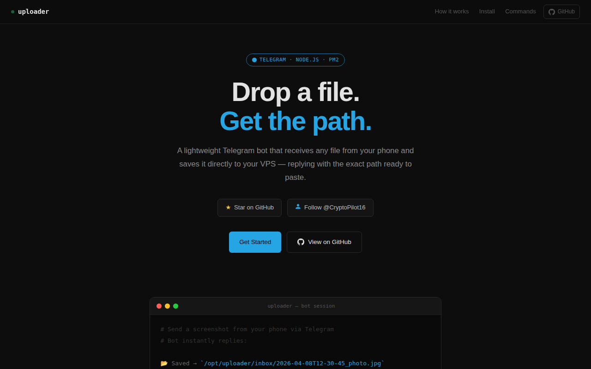

# Uploader

Telegram bot that saves files to your VPS and replies with the path.



---

## Before You Start

Make sure your VPS has the following installed:

**Node.js 18+**
```bash
node -v   # should print v18 or higher
```
If not installed: https://nodejs.org/en/download/package-manager

**pm2** (process manager — keeps the bot running after you log out)
```bash
npm install -g pm2
```

---

## Step 1 — Create a Telegram Bot

1. Open Telegram and search for **@BotFather**
2. Send it the message: `/newbot`
3. Follow the prompts — give your bot a name and username
4. BotFather will reply with a **bot token** that looks like:
   ```
   8771463368:AAEco1FGHQvShGKA8P3qn1JvS6j_nlHw_7A
   ```
5. Copy and save this token — you'll need it in Step 3

---

## Step 2 — Get Your Telegram User ID

1. Open Telegram and search for **@userinfobot**
2. Send it any message (e.g. `/start`)
3. It replies with your **numeric user ID**, e.g. `453466480`
4. Copy and save this number — you'll need it in Step 3

---

## Step 3 — Deploy to Your VPS

SSH into your VPS, then run:

```bash
# Clone the repo
git clone https://github.com/CryptoPilot16/vps-uploader /opt/uploader
cd /opt/uploader

# Install dependencies
npm install
```

Now open the config file:
```bash
nano ecosystem.config.js
```

Replace the placeholder values with your token and user ID:
```js
TELEGRAM_BOT_TOKEN: 'your-token-here',
ALLOWED_USER_ID: 'your-user-id-here',
```

Save and exit (`Ctrl+X`, then `Y`, then `Enter`).

---

## Step 4 — Start the Bot

```bash
# Start the bot
pm2 start ecosystem.config.js

# Save so pm2 remembers it
pm2 save

# Set pm2 to auto-start on VPS reboot
pm2 startup
# pm2 will print a command — copy and run it (it starts with "sudo env PATH=...")
pm2 save
```

---

## Step 5 — Test It

1. Open Telegram and find your bot by its username
2. Send it a photo or file
3. The bot should reply with a file path like:
   ```
   /opt/uploader/inbox/2026-04-08T12-30-45_photo.jpg
   ```

If nothing happens, check the logs:
```bash
pm2 logs vps-uploader
```

---

## Commands

| Command  | Description                        |
|----------|------------------------------------|
| `/help`  | Show available commands            |
| `/list`  | Show the last 10 files in inbox    |
| `/clear` | Delete all files in inbox          |

---

## Supported File Types

Send any of the following — the bot saves it and replies with the path:

- Photos / images
- Documents (any format, e.g. PDF, ZIP, PNG)
- Videos
- Voice messages / audio files

> Telegram's file size limit is **20 MB** per file.

---

## Updating the Config

If you need to change the token or user ID after first deploy:

```bash
nano /opt/uploader/ecosystem.config.js
# make your changes, save

pm2 delete vps-uploader
pm2 start ecosystem.config.js
pm2 save
```

---

## Checking Logs

```bash
pm2 logs vps-uploader            # live log stream
pm2 logs vps-uploader --lines 50 # last 50 lines
pm2 status                       # check if bot is running
```

---

## Notes

- Only your Telegram user ID can interact with the bot — all other users are silently ignored
- Files are saved to `/opt/uploader/inbox/` with a timestamp prefix
- Run `/clear` in Telegram when the inbox gets cluttered
